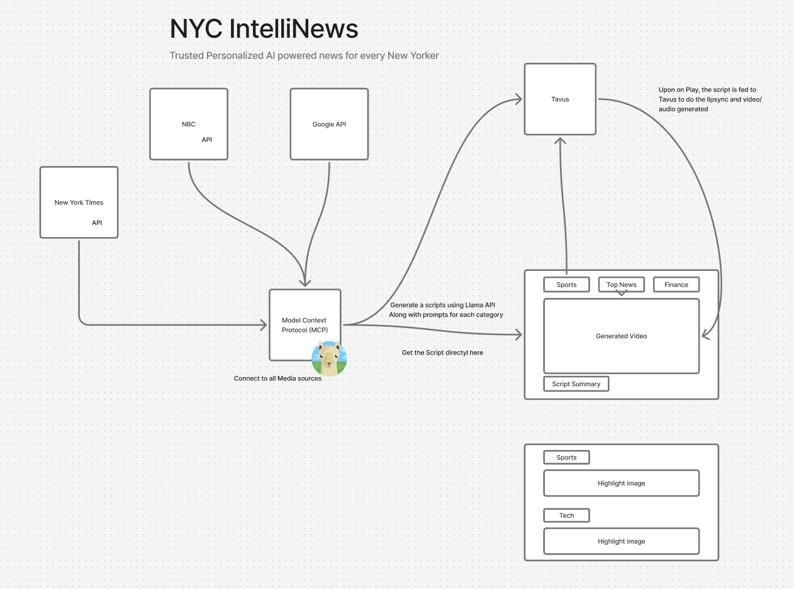

# NY IntelliNews

NYIntelliNews is an AI-powered news summarization platform that offers users a dynamic and interactive experience. By selecting topics of interest, users receive concise video summaries generated by Tavus personas, enhancing engagement and understanding of current events.


### The IDEA:
Here's the Figma Link: [Figma](https://www.figma.com/board/uy3R0XK8wIePxZdzSKad3Y/Hack?node-id=0-1&t=HHsxqQ5PASfQJeMa-1)



### Demo: [NYC IntelliNews - Meta Llama4 Hackathon](https://youtu.be/7HTO7GOZht8)


### Features
Topic Selection Interface: Users can choose from a variety of news topics to receive tailored summaries.

AI-Generated Video Summaries: Utilizes Tavus personas to deliver engaging video summaries of news articles.

Interactive Chat Interface: Provides a conversational platform for users to delve deeper into news content.

Confidence Scoring: Assigns confidence levels to summaries, indicating the reliability of the information presented.

### Tech Stack
Frontend: Next.js, React

Backend: Node.js, Express

AI Models: LLaMA-based summarization models

Video Generation: Tavus API integration for persona-based video summaries

Video Embedding: Daily.co SDK for seamless video integration


### Installation
Clone the repository:

```bash
git clone https://github.com/belanasaikiran/NYIntelliNews.git
cd NYIntelliNews
```

**Install dependencies:**

```bash
npm install
```

### Set up environment variables:

Create a .env.local file in the root directory.

Add necessary environment variables such as API keys and endpoints.

Run the development server:

```bash
npm run dev
```

### Usage:

Upon launching the application:

Select Topics: Choose from a list of news topics to receive summaries.

View Summaries: Watch AI-generated video summaries presented by Tavus personas.

Engage in Conversation: Use the chat interface to ask questions or delve deeper into specific news items.


### Front End Repo:

[Front End UI](https://github.com/belanasaikiran/NYIntelliNews-UI)


Input for Llama
```json
[
  {
    "title": "Apple's New iOS Update Brings Advanced AI Features",
    "url": "https://nytimes.com/ai-ios-update",
    "publisher": "New York Times",
    "confidenceScore": 0.95
  },
  {
    "title": "Google Launches Local AI App for Pixel Devices",
    "url": "https://techcrunch.com/google-local-ai",
    "publisher": "TechCrunch",
    "confidenceScore": 0.92
  },
  {
    "title": "OnePlus Embraces AI in New Flagship",
    "url": "https://wired.com/oneplus-ai-flagship",
    "publisher": "Wired",
    "confidenceScore": 0.88
  }
]
```

Curl request:

```bash
curl -X POST http://localhost:3000/summarize \
  -H "Content-Type: application/json" \
  -d '{"title": "Apple New iOS Update Brings Advanced AI Features", "url": "https://nytimes.com/ai-ios-update", "publisher": "New York Times"}'

```
